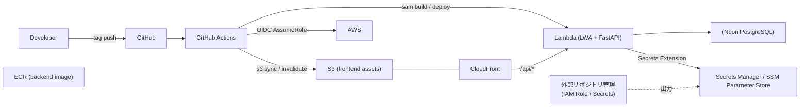

# TCH-19 デプロイパイプライン構築 実装計画

## 概要

Tasche のデプロイパイプライン (frontend / backend を独立して dev / prod それぞれにデプロイ可能) を SAM + GitHub Actions で構築する。今回のスコープは **dev 環境のみ**。prod は枠（タグ命名規約・workflow ファイル）だけ用意し、本番リソース作成は後追い。

Plane 課題: TCH-19 「デプロイパイプライン構築」

## ゴール

- `release/{app}-{env}/<version>` というタグを push すると、対応する環境にデプロイされる。
- frontend と backend が独立してデプロイできる。
- devが独立してデプロイできる。(prodは別タスクで対応)
- 手順が再現可能で、人手介入は「タグを切る」と「マイグレーションを手動実行」のみ。

## 決定事項サマリ

| カテゴリ | 決定内容 |
|---|---|
| リージョン | `ap-southeast-1` (Neon に合わせる) |
| 今回スコープ | dev のみ。prod は枠のみ用意 |
| FE 構成 | S3 + CloudFront、独自ドメイン (`dev.tasche-app.com`) |
| BE 構成 | Lambda (コンテナイメージ) + Lambda Web Adapter。将来 ADOT 連携予定 |
| AWS 認証 | GitHub OIDC で IAM ロール AssumeRole |
| SAM 配置 | `packages/{frontend,backend}/infra/template.yaml` |
| DB マイグレーション | ユーザー手動実行 (alembic upgrade head) |
| デプロイトリガー | タグ運用 `release/{app}-{env}/<version>` |
| dev タグ命名 | `release/frontend-dev/<version>`, `release/backend-dev/<version>` |
| prod タグ命名 | `release/frontend-prod/YYYY-MM-DD-N`, `release/backend-prod/YYYY-MM-DD-N` |
| concurrency | `deploy-${env}-${app}` で同一環境を直列化 |
| ロールバック | `workflow_dispatch` でタグ/コミット指定再デプロイ |
| Secret 取得 | Parameters and Secrets Lambda Extension (Layer zip をコンテナイメージに焼き込み) |
| Secret 構造 | 単一 Secret に JSON 形式で複数キー (費用削減) |
| 外部 ARN 連携 | SSM Parameter Store の命名規約 `/tasche/${env}/...` を介して受け渡し |
| 命名規約管理 | `docs/deploy/ssm-naming.md` (本タスクで作成) で明文化 |
| ADR | 完了後に「Lambda パッケージ方式」「デプロイ戦略」の 2 本を起票 |

## アーキテクチャ図 (Mermaid)

## SSM Parameter Store 命名規約 (外部リポと共有)

外部リポジトリは以下のパスに値を出力する。本リポの SAM テンプレートはこのパスを `{{resolve:ssm:/tasche/${Env}/...}}` で参照する。

| パス | 型 | 内容 | 利用先 |
|---|---|---|---|
| `/tasche/${env}/iam/lambda-execution-role-arn` | String | Backend Lambda の実行ロール ARN | backend SAM |
| `/tasche/${env}/iam/github-deploy-role-arn` | String | GitHub Actions が AssumeRole する ARN | GitHub Actions workflow (Variables 経由でも可) |
| `/tasche/${env}/secrets/app-secret-arn` | String | アプリ機密値を JSON でまとめた SecretsManager Secret の ARN (db_url / jwt_secret / google_oauth_client_id / google_oauth_client_secret を含む) | backend (Secrets Extension) |
| `/tasche/${env}/frontend/domain` | String | FE 独自ドメイン (`dev.tasche-app.com` 等) | frontend SAM |
| `/tasche/${env}/frontend/acm-certificate-arn` | String | ACM 証明書 ARN (us-east-1) | frontend SAM |
| `/tasche/${env}/frontend/hosted-zone-id` | String | Route53 Hosted Zone ID | frontend SAM (任意) |

詳細は `docs/deploy/ssm-naming.md` を参照。

## 実装ステップ

### Step 1. SSM 命名規約ドキュメント作成

- 新規ファイル: `docs/deploy/ssm-naming.md`
- 上記表の詳細・期待する値の例・外部リポへの依頼事項を記述。
- 外部リポ実装が完了するまでの暫定対応として、`SAM Parameter` でフォールバック値を指定可能にする方針を併記。

### Step 2. backend: 本番 Dockerfile 作成 (LWA + Secrets Extension)

- 新規ファイル: `packages/backend/Dockerfile`
- ベース: `public.ecr.aws/lambda/python:3.12` 系ではなく、Lambda Web Adapter 想定のため `python:3.12-slim` ベース + LWA バイナリ COPY とする。
- `COPY --from=public.ecr.aws/awsguru/aws-lambda-adapter:0.9.0 /lambda-adapter /opt/extensions/lambda-adapter`
- Parameters and Secrets Lambda Extension を Layer ではなく Lambda 環境にアタッチ（コンテナの場合は Lambda Layer 互換が無いので、Layer ARN を SAM 側で `Layers:` 指定するか、Extension をイメージ内に焼き込む）。
  - 推奨: SAM の `Layers` プロパティでコンテナ Lambda にも Extension Layer をアタッチ可能 (2023〜)。
- `uv` で依存をインストール、uvicorn を `0.0.0.0:8080` で起動。`AWS_LWA_PORT=8080` を環境変数で設定。

### Step 3. backend: `core/config.py` 改修

- `pydantic-settings` の `Settings` を 2 段階に分け、環境変数で値が来ない場合は Secrets Extension (`http://localhost:2773/secretsmanager/get?secretId=...`) から取得する `SecretLoader` を追加。
- `SECRETS_BACKEND` env で `extension` / `env` (ローカル用) を切り替え。
- 既存テストが落ちないようローカルは `env` モードを既定値とする。

### Step 4. backend: Mangum 依存削除 + folder-structure 更新

- `packages/backend/pyproject.toml` から `mangum` を削除。
- `packages/backend/src/tasche/handler.py` を削除。
- `packages/backend/docs/folder-structure.md` の「Lambda 対応」を Mangum → Lambda Web Adapter に書き換え、`handler.py` 行を削除。

### Step 5. backend: SAM テンプレート作成

- 新規ファイル: `packages/backend/infra/template.yaml`, `packages/backend/infra/samconfig.toml`
- 主要リソース:
  - `AWS::Serverless::Function` (PackageType: Image, Architectures: arm64)
    - `Role: !Sub '{{resolve:ssm:/tasche/${Env}/iam/lambda-execution-role-arn}}'`
    - `FunctionUrlConfig` で公開 (CloudFront から参照)
    - `Environment.Variables` に `APP_ENV`, `SECRETS_BACKEND=extension`, 各 SSM 参照値
    - `Layers` に Parameters and Secrets Lambda Extension の Layer ARN (region別、SAM Mappings で管理)
- `Parameters: Env (dev|prod)`, `ImageUri` を CI から渡す。
- Outputs: Function URL, Function Name, Function Role 名。

### Step 6. frontend: SAM テンプレート作成

- 新規ファイル: `packages/frontend/infra/template.yaml`, `packages/frontend/infra/samconfig.toml`
- 主要リソース:
  - `AWS::S3::Bucket` (静的ファイル用、OAC 経由のみアクセス可)
  - `AWS::CloudFront::Distribution`
    - Default Behavior: S3 origin (静的)
    - `/api/*` Behavior: Backend Function URL (CachePolicy = CachingDisabled, OriginRequestPolicy = AllViewerExceptHostHeader)
    - Aliases: `{{resolve:ssm:/tasche/${Env}/frontend/domain}}`
    - ViewerCertificate: `{{resolve:ssm:/tasche/${Env}/frontend/acm-certificate-arn}}`
  - `AWS::Route53::RecordSet` は外部リポ側に任せ、本リポでは出力のみ。
- Backend Function URL は SAM Parameter として CI から渡す。

### Step 7. GitHub Actions workflows

新規ファイル:
- `.github/workflows/deploy-backend-dev.yml`
- `.github/workflows/deploy-frontend-dev.yml`

共通仕様:
- `on: push: tags: ['release/{app}-{env}/**']` + `workflow_dispatch`
- `permissions: id-token: write, contents: read`
- `concurrency: deploy-${{ env }}-${{ app }}` (cancel-in-progress: false)
- Step:
  1. `actions/checkout@v4`
  2. `aws-actions/configure-aws-credentials@v4` (OIDC, role ARN は GitHub Variables から)
  3. backend のみ: ECR ログイン → `sam build` → `sam deploy`
  4. frontend のみ: pnpm install → `pnpm --filter @tasche/frontend build` → `aws s3 sync` → CloudFront invalidation → `sam deploy`
- prod workflow は **本タスクでは作成しない**。別タスクで対応 (Step 9 を参照)。

### Step 8. 外部リポジトリ向け要件ドキュメント作成

- 新規ファイル: `tmp/plan/external-repo-requirements.md`
- 内容: 外部リポジトリ側で用意してもらうリソース一覧 (IAM ロール、SecretsManager、ACM、Route53、SSM Parameter) と、本リポが期待する命名規約・出力フォーマットを記載。
- このリポでは管理しないが、デプロイの前提となる依頼事項を一箇所にまとめる。

### Step 9. prod 関連タスクを Plane に登録

- Plane 上に prod 用デプロイ workflow 作成タスクを起票する (`deploy-frontend-prod.yml`, `deploy-backend-prod.yml`、prod 環境の SSM パラメータ整備等)。
- 本タスク (TCH-19) のフォロータスクとして追跡可能にする。

### Step 10. ADR 起票 (作業完了後)

- `docs/adr/ADR005-backend-lambda-packaging.md` (LWA+コンテナ+ADOT 採用)
- `docs/adr/ADR006-deploy-trigger-strategy.md` (タグベースデプロイ戦略)

## 完了基準への追加項目

- [ ] `tmp/plan/external-repo-requirements.md` が作成され、外部リポへの依頼内容が明文化されている。
- [ ] prod workflow 作成のフォロータスクが Plane に登録されている。

## 動作確認手順 (ユーザー実施)

1. 外部リポで SSM Parameter とロール/Secret を作成済みであることを確認。
2. 本リポの dev タグ (`release/backend-dev/2026-05-08-1`) を push → backend dev デプロイが流れる。
3. 同様に `release/frontend-dev/2026-05-08-1` を push → frontend dev デプロイが流れる。
4. CloudFront URL から `/api/health` 200 OK を確認、SPA 表示を確認。
5. ロールバックは `workflow_dispatch` で旧タグ/コミットを指定して再実行できることを確認。

## リスク / 留意点

- **Parameters and Secrets Lambda Extension のコンテナ対応**: コンテナ Lambda にも `Layers:` でアタッチ可能だが、対応 Layer ARN はリージョン別。`ap-southeast-1` の ARN を SAM Mappings に登録する必要あり。
- **CloudFront → Function URL のオリジン認証**: 当面は AuthType=NONE で公開 + CloudFront の Origin Access Control (Lambda Function URL 用) を有効化 (2024 年に GA)。
- **ACM 証明書は us-east-1 必須**: 外部リポ側で us-east-1 に発行してもらう。
- **デプロイ初回は ECR リポジトリの事前作成が必要**: SAM で同居作成も可だが、外部リポ管理に揃える方が良いか別途相談。

## 完了基準

- [ ] dev 環境で `sam deploy` が成功し、Function URL から /api/health が 200 を返す。(sam deployはユーザーが実行)
- [ ] dev 環境で SPA が独自ドメインから配信され、`/api/*` が Backend に届く。
- [ ] タグ push で GitHub Actions が動き、デプロイが冪等に再現できる。
- [ ] ロールバック手順 (workflow_dispatch でタグ指定再デプロイ) が動作する。
- [ ] SSM 命名規約と ADR がドキュメントとして残っている。
